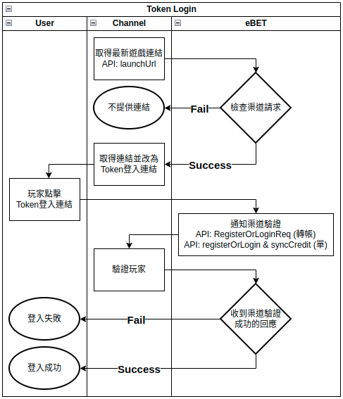

# Token登入

<figure><figcaption></figcaption></figure>


游戏连结如何变成Token登入连结？&#x20;

在取得的游戏连结后面添加"?"并添加参数"username"和"accessToken"及参数值

url example : http://\<eBET提供的H5 Game连结>?username=testmember\&accessToken=testaccesstoken



?：路径与参数分隔符 ； &：参数之间的分隔符&#x20;

以"?"(问号)开始第一个参数，同"&"(连接符)来串联多个参数和值。


## 可以串连的其他参数



携带该参数，可以使介面变更语言

`该参数仅适用于在有申请开放的语言并新会员`进行`第一次登入`，后续切换语言请用户使用前台语言变更









