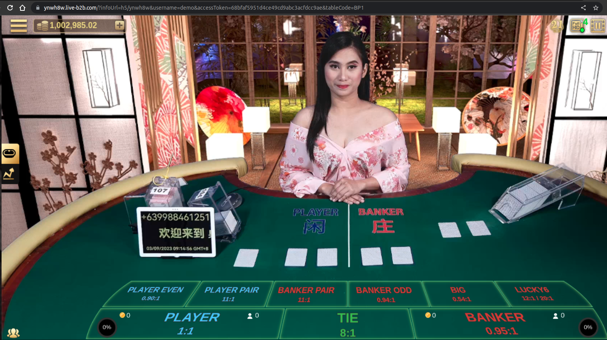

# Token登入

<figure><figcaption>
Token登入的API操作流程
</figcaption></figure>

<table data-card-size="large" data-view="cards" data-full-width="false"><thead><tr><th></th><th></th><th></th><th></th></tr></thead><tbody><tr><td>与流程相关的API页面(转帐钱包)</td><td>launchUrl</td><td>RegisterOrLoginReq</td><td>UserInfo</td></tr><tr><td>与流程相关的API页面(单钱包)</td><td>launchUrl</td><td>registerOrLogin</td><td>syncCredit</td></tr></tbody></table>


<mark style="color:blue;">Q：游戏连结如何变成Token登入连结？</mark>&#x20;

<mark style="color:blue;">A：在取得的游戏连结后面添加"?"和参数"username" & "accessToken"</mark>

<mark style="color:blue;">url example : http://\<eBET提供的H5 Game连结>?username=testmember\&accessToken=testaccesstoken</mark>



<mark style="color:orange;">?：路径与参数分隔符 ； &：参数之间的分隔符</mark>&#x20;

<mark style="color:orange;">以"?"(问号)开始第一个参数，同"&"(连接符)来串联多个参数和值。</mark>


## 可以串连的其他参数



连结后方添加参数language，可以使介面变更语言\
该参数<mark style="background-color:red;">仅适用于在有申请开放的语言并新会员进行第一次登入</mark>，后续切换语言请用户使用前台语言变更





连结后方添加参数dgt / gameType，可以进入指定游戏大厅

### dgt

该参数<mark style="background-color:red;">只适用于PC H5页面</mark>且只能输入一个参数值。进入ebet游戏后仍可切换至其他游戏。&#x20;

<figure><figcaption>
url example : http://&#x3C;eBET提供的H5 Game连结>&#x26;dgt=1
</figcaption></figure>

### gameType

适用任意平台页面。 输入一个参数值时，为独立介面。 \
可输入多个参数值，进入ebet游戏后只会显示特定游戏。&#x20;

<figure><figcaption>
url example 1 : http://&#x3C;eBET提供的H5 Game连结>&#x26;gameType=1
</figcaption></figure>

<figure><figcaption>
url example 2 : http://&#x3C;eBET提供的H5 Game连结>&#x26;gameType=1,2,3,4
</figcaption></figure>





连结后方添加参数tableCode，可以进入指定游戏桌&#x20;

<figure><figcaption>
url example : http://&#x3C;eBET提供的H5 Game连结>&#x26;tableCode=BP1
</figcaption></figure>

slot游戏有另外的连结，请使用api：loginslot。 \
mini-game有另外的连结，请使用api：loginTableGame。\

棋牌游戏仅提供进入大厅的功能，请添加相关参数。 \
url example : http://\<eBET提供的H5 Game连结>\&gameType=30\&tableCode=virtual\_blackjack\





